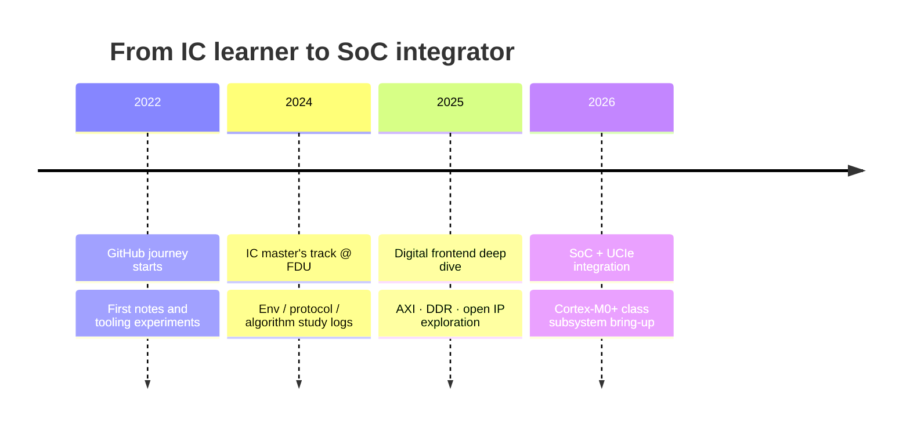
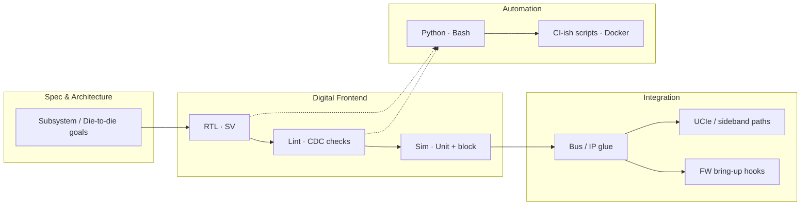

 

## 🧭 About me

- 🎓 **IC Master's student @ Fudan University (FDU)** — based in Shanghai
- 🔌 Focus: **SoC / digital frontend** — RTL, subsystem integration, lint & bring-up
- 🧩 Recent work theme: **Cortex-M0+ class SoC integration** and **UCIe** sideband / interconnect paths (lab / private tracks)
- 🛠 Comfort zone: Verilog / SystemVerilog, C/C++ for firmware & tools, Python/Bash for EDA automation
- ✍️ Learning notes live on [RockyQLuo.github.io](https://rockyqluo.github.io) — *rookie in IC*, still shipping

> 🎯 **2026 focus** — tighten the loop from **RTL → lint → sim → integration**, document the hard parts, and turn chip-side friction into reusable flows.

## 🚀 The journey so far

## 🧠 Stack map (how I think about a chip)

## 🧰 Arsenal

**Languages & HDL**

 

**Platform & workflow**

🗂 <b>Skill notes (what each row actually means)</b>

 

| Area | What I use it for |
|---|---|
| **HDL** | Verilog / SystemVerilog RTL, block & subsystem integration |
| **C / C++** | Bring-up, firmware hooks, host-side utilities around the SoC |
| **Python / Bash** | EDA glue, regression wrappers, repo hygiene |
| **Linux / Docker / Git** | Reproducible tool envs, daily design-flow hygiene |
| **Scala (read)** | Chisel / open hardware projects (e.g. Chipmunk exploration) |
| **MATLAB** | Algorithm / signal checks when the design needs it |

## 📚 Learning tracks (open-source IP I study)

> Private lab work stays private. Public signal is **what I fork, read, and re-implement against**.

| Track | Repos I keep close |
|---|---|
| 🚌 **On-chip interconnect** | [verilog-axi](https://github.com/RockyQLuo/verilog-axi) · [common_cells](https://github.com/RockyQLuo/common_cells) · [connect](https://github.com/RockyQLuo/connect) |
| 💾 **Memory path** | [UberDDR3](https://github.com/RockyQLuo/UberDDR3) |
| 🧮 **Open hardware / Chisel** | [chipmunk](https://github.com/RockyQLuo/chipmunk) |
| 🧰 **Env & notes** | [dotfiles](https://github.com/RockyQLuo/dotfiles) · [RockyQLuo.github.io](https://github.com/RockyQLuo/RockyQLuo.github.io) |

## 🏠 Public corners

<table>
<tr>
<td align="center" width="50%">
<a href="https://github.com/RockyQLuo/RockyQLuo.github.io"><picture><source media="(prefers-color-scheme: dark)" srcset="https://socialify.git.ci/RockyQLuo/RockyQLuo.github.io/image?description=1&font=Inter&language=1&name=1&owner=1&pattern=Plus&stargazers=1&theme=Dark"></picture></a>
</td>
<td align="center" width="50%">
<a href="https://github.com/RockyQLuo/dotfiles"><picture><source media="(prefers-color-scheme: dark)" srcset="https://socialify.git.ci/RockyQLuo/dotfiles/image?description=1&font=Inter&language=1&name=1&owner=1&pattern=Plus&stargazers=1&theme=Dark"></picture></a>
</td>
</tr>
</table>

## 📈 Activity

## 🐍 Contribution snake

<picture>
  <source media="(prefers-color-scheme: dark)" srcset="https://raw.githubusercontent.com/RockyQLuo/RockyQLuo/output/github-contribution-grid-snake-dark.svg">
  <source media="(prefers-color-scheme: light)" srcset="https://raw.githubusercontent.com/RockyQLuo/RockyQLuo/output/github-contribution-grid-snake.svg">
  
</picture>

*"Show me the code — then show me it boots on silicon."*

<!-- profile-readme-active -->
